# Affect Counsel Unity

[한국어 문서](README.ko.md) · [English documentation](README.en.md) · [언어 선택](README.md)

한국어 1:1 상담사 훈련을 위한 독립형 Unity 프로토타입입니다. Microsoft Rocketbox 성인 아바타와 로컬 웹캠 신호를 사용해 상담자의 언어적 반응과 비언어적 전달이 어떻게 함께 전달되는지 연습합니다.

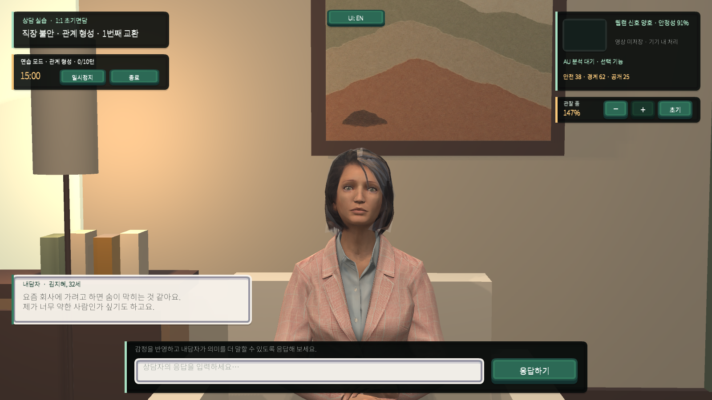

> **연구·훈련용 프로토타입:** 진단, 감정 판정, 상담역량 자동평가 도구가 아닙니다. 얼굴 동작값은 자기 점검과 연구 검증을 위한 관찰 신호로만 사용합니다.

## 공간 디자인 기준

상담자 시점에서 내담자와 가깝게 마주 앉되 책상 같은 물리적 장벽을 두지 않는 구성을 사용합니다. 따뜻한 아이보리 벽, 밝은 패브릭 의자, 세이지 커튼, 월넛 수납장, 원형 사이드 테이블과 티슈, 간접 스탠드 조명, 식물, 한지 산수 액자로 전형적인 상담실의 안정감과 한국적 맥락을 표현했습니다. 장식보다 내담자의 얼굴·상체·손 관찰성을 우선합니다.

| 생성한 공간 레퍼런스 | Unity 구현 |
|---|---|
| 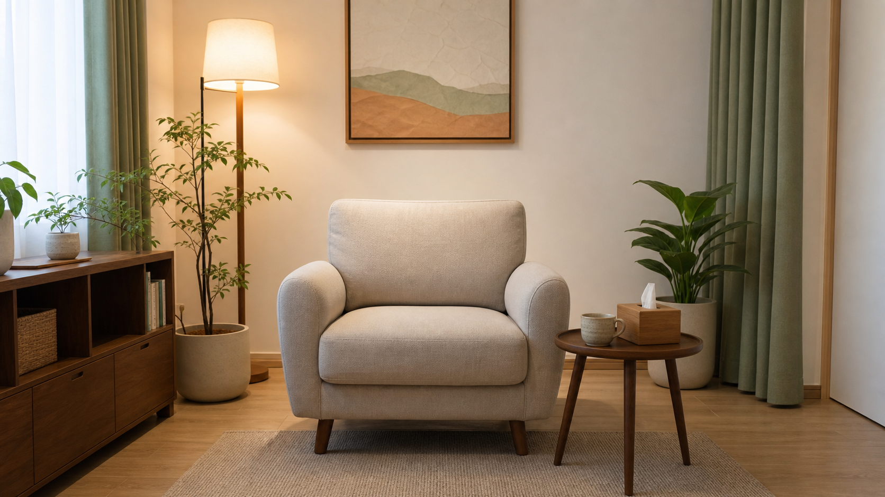 |  |

UI는 CC0 라이선스의 Kenney UI Pack 2.0에서 고해상도 9-slice 패널·버튼·구분선을 선별하고 상담실 팔레트로 틴트했습니다. 상단 언어 버튼은 상담 시나리오의 원문을 바꾸지 않고 고정 UI 문구만 전환합니다.

| 한국어 UI | English UI |
|---|---|
| 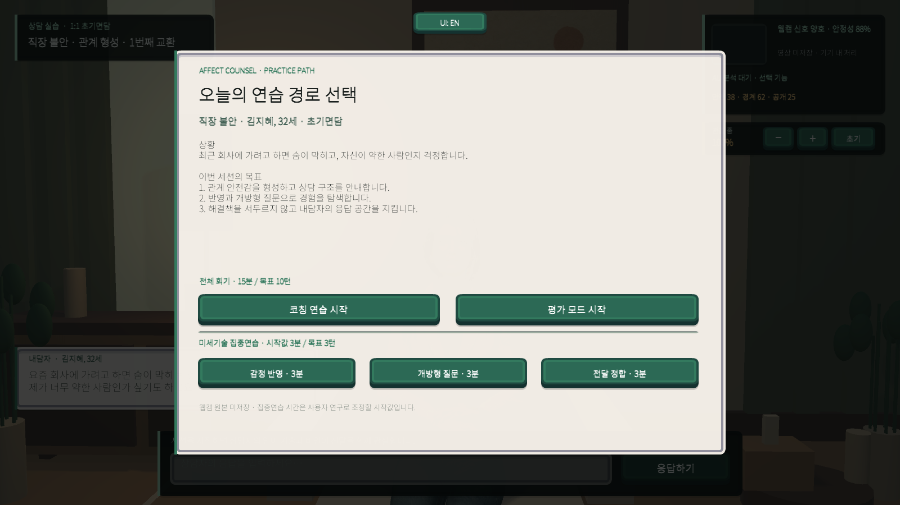 |  |

## 현재 상태

| 영역 | 구현 상태 |
|---|---|
| 1:1 상담 장면 | 가까운 카메라, 얼굴·상체·손 제스처 관찰 가능 |
| 한 회기 진행 | 브리핑 → 15분 상담 → 일시정지·재개·종료 → 디브리핑 |
| 내담자 상호작용 | 불안 사례 기반 10턴 공개 사다리, 표정·시선·발화 애니메이션 |
| 훈련 모드 | 즉시 코칭이 있는 연습 모드와 지연 피드백 평가 모드 |
| LXD 연습 루프 | 사례 선택 → 3분 집중연습 → 장면별 자기평가 → 근거 비교 → 선택 장면 재연습 |
| 사례 저작 | ScriptableObject에 목표·공개 사다리·집중기술·회기 길이 분리 |
| 상담 반응 피드백 | 언어 기술과 얼굴 전달 단서의 정합·불일치 가능성 구분 |
| 얼굴 동작 입력 | MediaPipe Face Landmarker 기반 13개 AU proxy |
| 개인 기준선 | 시작 후 10초 동안 중립 표정 보정, 이후 기준선 차감 |
| 관계 궤적 | 안전감·경계성·공개의지가 다음 내담자 반응을 결정 |
| 관찰 줌 | 마우스 휠, −/+, 초기화 버튼으로 얼굴·자세 관찰 범위 전환 |
| UI 언어 | 상단 `UI: EN / UI: KO` 토글로 고정 UI 문구를 한국어·영어로 전환; 내담자 대사와 상담 입력 원문은 유지 |
| 데이터 기록 | 원본 영상 없이 파생 신호, 정합성, 관계 궤적을 JSONL 기록 |

## 한 회기 진행

브리핑에서 사례와 목표를 확인한 뒤 연습 또는 평가 모드를 선택합니다. 세션 중에는 관계 형성, 초기 탐색, 감정 심화, 핵심 탐색, 정리, 종결의 6단계가 상담 턴과 내담자의 공개의지에 따라 진행됩니다. 일시정지하면 타이머와 입력이 함께 멈추며, 종료 후에는 진행 시간, 최종 단계, 관계 궤적, 전달 정합, 언어기술 요약을 확인할 수 있습니다.

| 사례 브리핑 | 한 회기 디브리핑 |
|---|---|
| 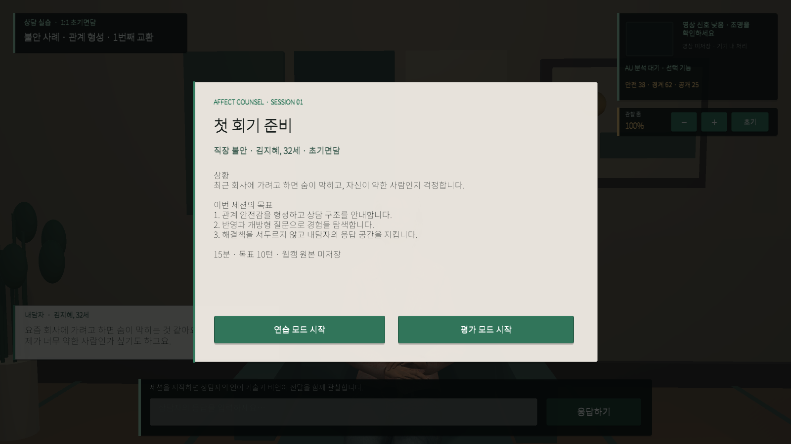 | 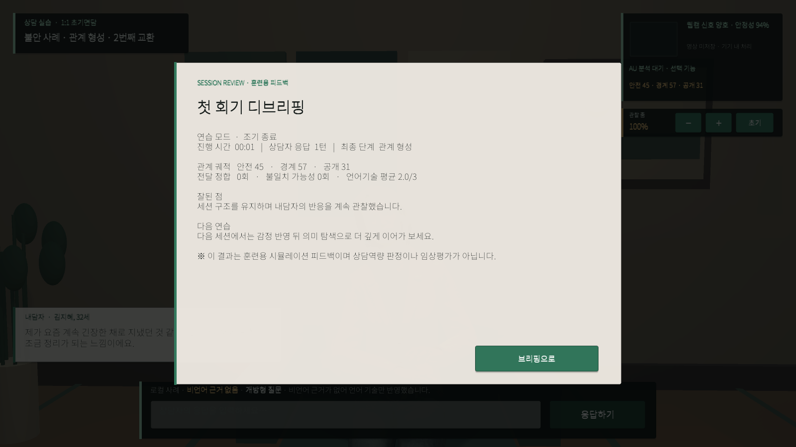 |

| 상담 진행 | 일시정지 |
|---|---|
|  | 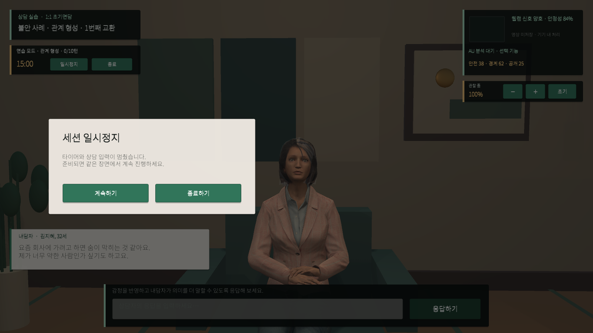 |

현재 15분과 목표 10턴, 단계 전환 임계값은 미세 사용성 검사를 위한 시작값입니다. 임상적 표준이나 검증된 숙련도 기준이 아니며, 상담 전문가 검토와 사용자 연구를 통해 조정해야 합니다.

## LXD 집중연습과 성찰 루프

브리핑에서 전체 회기 외에 감정 반영, 개방형 질문, 전달 정합 중 하나를 골라 `3분·3턴` 집중연습을 시작할 수 있습니다. 3분과 3턴은 파일럿용 시작값이며 검증된 훈련 기준이 아닙니다. 사례 내용, 학습목표, 공개 사다리, 집중기술은 [`WorkplaceAnxietyCase.asset`](Assets/Data/Cases/WorkplaceAnxietyCase.asset)에 분리되어 있어 새 사례를 같은 구조로 추가할 수 있습니다.

| 연습 경로 선택 | 3분 집중연습 |
|---|---|
| 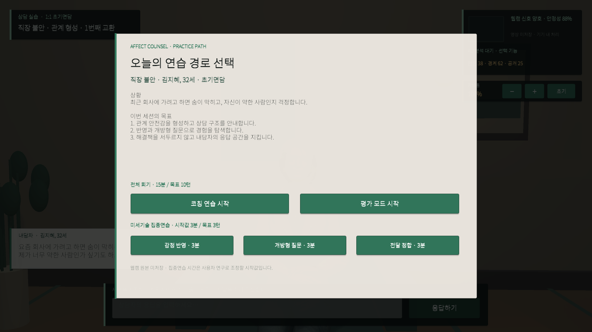 | 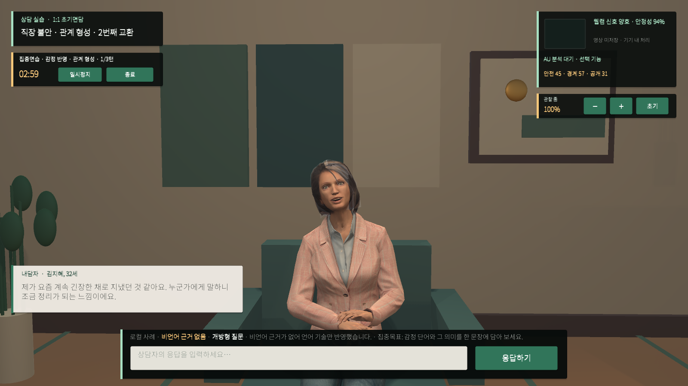 |

세션이 끝나면 턴 타임라인에서 장면을 고릅니다. 시스템 근거와 재연습 버튼은 먼저 `잘된 장면` 또는 `다시 연습 필요`를 선택한 뒤에만 공개·활성화됩니다. 재연습은 선택한 장면의 원래 내담자 상태와 발화를 복원하고 한 번의 새 응답을 받아 원래 결과와 비교합니다.

| 자기평가 전 | 자기평가 후 | 선택 장면 재연습 |
|---|---|---|
|  | 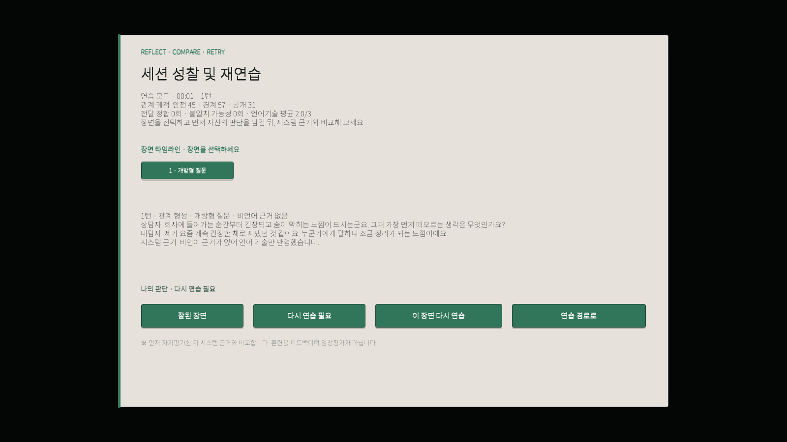 | 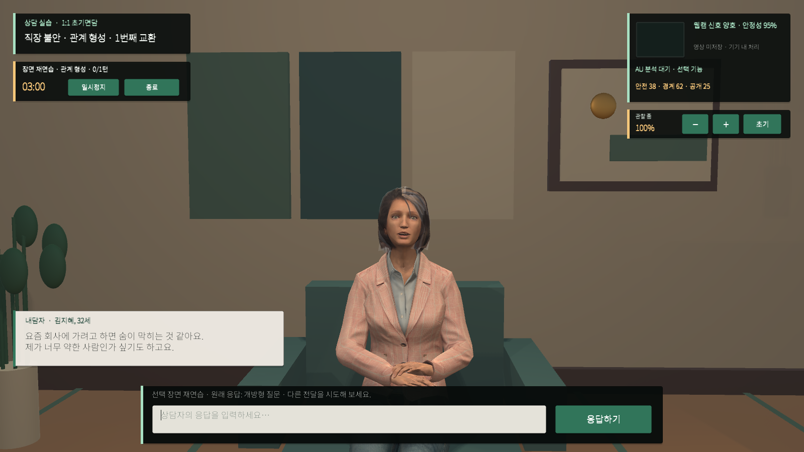 |

집중연습은 3턴을 완료하면 자동으로 성찰 화면으로 이동하며, 재연습 결과는 원래 장면과 새 시도의 언어기술 품질을 함께 표시합니다.

## 연구 설계의 중심

이 프로젝트는 상담자의 감정을 판정하지 않습니다. 상담자가 선택한 미세 상담기술과 관찰 가능한 전달 단서가 서로 어울리는지, 그리고 그 조합이 내담자의 관계 안전감·경계성·공개의지라는 시뮬레이션 상태를 어떻게 바꾸는지 훈련합니다.

```text
상담자 언어 기술 + 보정된 전달 단서
        ↓ 시간 정렬
정합 / 가능한 불일치 / 관계 순서 불일치 / 근거 없음
        ↓
내담자 안전감 · 경계성 · 공개의지
        ↓
다음 발화의 개방 또는 위축
```

첫 파일럿은 공감·탐색 발화 중 AU04·AU12 proxy와, 내담자가 경계된 상태에서의 조언 우선 반응만 사용합니다. 임계값은 임상 기준이나 역량 점수가 아니라 전문가 평정으로 조정해야 할 시작값입니다. 시선·침묵·발화속도·고개 끄덕임·동조성은 아직 측정하지 않으며 현재 피드백에 포함하지 않습니다. 전체 근거, 문화 프로필 원칙, 검증 계획은 [GAME_CONCEPT.md](GAME_CONCEPT.md)에 정리했습니다.

| 전달 정합 | 관계 순서 불일치 |
|---|---|
|  |  |

### 내담자 관찰 줌

우측 상단의 `−`, `+`, `초기` 버튼이나 마우스 휠로 관찰 범위를 바꿀 수 있습니다. 키보드는 `-`, `+`, `0`을 지원합니다. 입력창과 다른 HUD 위에서 휠을 움직일 때는 카메라가 변하지 않습니다.

| 얼굴·미세표정 관찰 147% | 자세·손 제스처 관찰 74% |
|---|---|
| 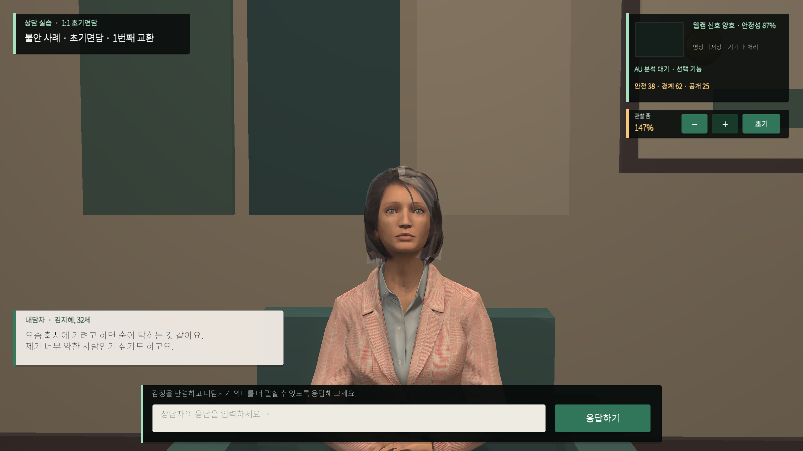 | 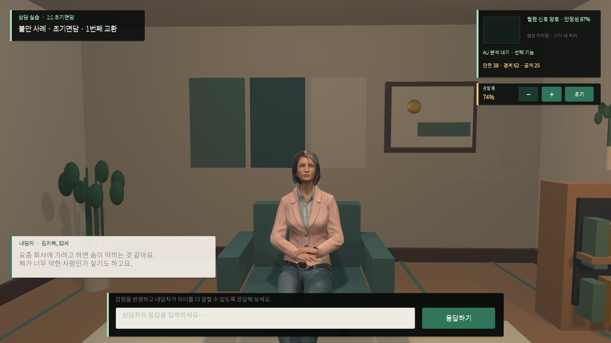 |

줌은 카메라를 이동하지 않고 시야각을 26°–52° 사이에서 부드럽게 조절합니다. 따라서 상담실의 시선축은 유지되며 극단적인 왜곡이나 내담자 모델 관통을 방지합니다.

## 현재 구현

- 불안 사례 기반 10턴 한 회기 시뮬레이션과 6단계 진행
- 사례 브리핑, 연습·평가 모드, 15분 타이머, 일시정지·재개·종료, 디브리핑
- ScriptableObject 기반 사례·학습목표·10단계 공개 사다리·집중기술 저작
- 3분·3턴 미세기술 집중연습, 장면 타임라인, 선 자기평가, 시스템 근거 비교, 선택 장면 재연습
- 반영, 정서 타당화, 개방형 질문, 조언 중심 반응을 구분하는 로컬 휴리스틱 피드백
- Rocketbox 내담자 아바타의 시선, 표정, 발화 애니메이션
- 웹캠 프레임의 밝기 품질과 움직임 안정성 신호
- MediaPipe Face Landmarker의 52개 blendshape를 선택 AU proxy로 변환하는 로컬 브리지
- 10초 중립 표정 기준선 보정과 보정 전·후 상태 표시
- 관계 안전감·경계성·공개의지 변화와 세션 JSONL 기록
- 정합성 유형, 문화 프로필, 피드백 근거를 포함한 턴 단위 기록
- 한국 상담실을 참고한 따뜻한 목재·크림색·간접조명 환경

### 중립 표정 보정

| 보정 중 | 보정 완료 |
|---|---|
| 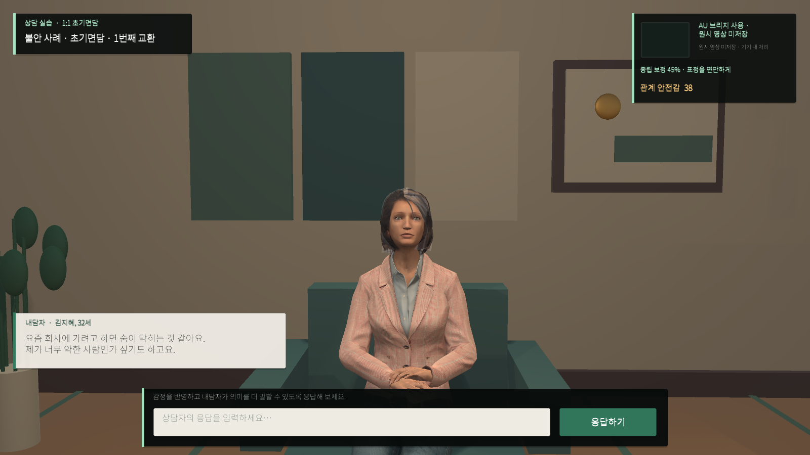 |  |

웹캠에서 얼굴이 추적되면 10초 동안 편안한 중립 표정의 개인 기준선을 계산합니다. 보정이 끝난 뒤에는 각 proxy에서 기준선을 차감하며, 세션 로그의 `auCalibrated` 값으로 보정 완료 여부를 구분합니다.

## 실행

- Unity: `6000.4.9f1`
- 시작 씬: `Assets/Scenes/KoreanCounselingRoom.unity`
- Windows 빌드: `Builds/AffectCounselDemo/AffectCounsel.exe`

에디터 메뉴 `Tools > Affect Counsel > Build Korean Counseling Room`으로 씬을 다시 생성할 수 있습니다.

## 개인정보와 해석 한계

- 웹캠 원본 영상은 저장하지 않습니다.
- 현재 웹캠 기능은 얼굴 감정 분류기가 아니라 조명 품질과 움직임 안정성을 계산하는 입력 어댑터입니다.
- 움직임 신호는 상담 능력이나 감정을 판정하지 않으며, 훈련자에게 자기 점검 단서로만 제시해야 합니다.
- 세션 기록에는 상담자 입력 문장과 파생 신호가 포함됩니다. 실제 교육 배포 전 명시적 동의, 보존 기간, 삭제 기능, 가명화 정책이 필요합니다.
- 턴 기록: Unity `Application.persistentDataPath/counseling-sessions.jsonl`
- 회기 요약: Unity `Application.persistentDataPath/counseling-session-summaries.jsonl`
- 자기평가: Unity `Application.persistentDataPath/counseling-self-assessments.jsonl`

## 다음 개발 단계

1. GPT Realtime 대화 어댑터와 로컬 데모 어댑터를 공통 인터페이스로 분리
2. 백엔드에서 Realtime 임시 토큰을 발급하고 Unity는 WebRTC로 연결
3. 전문가 저작용 ScriptableObject 사례 편집기와 루브릭 버전 관리 추가
4. 웹캠 처리의 온디바이스 보장, 동의 화면, 즉시 삭제 기능 구현
5. 교육자 대시보드와 세션 리플레이에는 원본 영상 대신 이벤트·점수 타임라인만 사용
6. 상담 전문가/학습자 대상 사용성 연구와 채점자 간 신뢰도 검증

## GPT Realtime 목표 구조

`Unity microphone → WebRTC → GPT Realtime → audio/transcript events → Rocketbox lip-sync + affect state`

- 권장 모델: `gpt-realtime-2.1`
- Unity 빌드에는 표준 OpenAI API 키를 포함하지 않습니다.
- 개발자 소유 백엔드가 `/v1/realtime/client_secrets`로 임시 토큰을 발급합니다.
- 사례 프롬프트는 내담자 역할과 정보 공개 단계를 제어하고, 평가는 별도의 구조화된 루브릭 단계에서 수행합니다.
- 연결 실패 시 현재 로컬 10턴 사례 시뮬레이션으로 자동 대체합니다.

### 로컬 실행

.NET 10 SDK가 필요합니다. PowerShell에서 표준 키를 현재 프로세스 환경에만 설정하고 토큰 브로커를 실행합니다. 키를 Unity 프로젝트나 설정 파일에 저장하지 마세요.

```powershell
$env:OPENAI_API_KEY = "사용자 키"
dotnet run --project .\Server\AffectCounsel.TokenBroker
```

브로커가 실행된 뒤 다음과 같이 Realtime 모드를 시작합니다.

```powershell
.\Builds\AffectCounselDemo\AffectCounsel.exe --realtime
```

`--realtime`을 생략하거나 브로커 연결이 실패하면 기존 로컬 사례 엔진을 사용합니다. 현재 구현은 먼저 텍스트 Realtime 대화를 연결하며, 마이크 음성 스트리밍과 GPT 음성 재생은 다음 단계입니다.

## 실시간 얼굴 동작 계수

AU 모드는 Python 브리지가 웹캠을 직접 읽고 UDP loopback으로 Unity에 파생값만 전달합니다. 원본 프레임은 파일이나 세션 로그에 저장하지 않습니다.

```powershell
uv run .\Tools\AuBridge\face_au_bridge.py
.\Builds\AffectCounselDemo\AffectCounsel.exe --au
```

화면에는 보정 진행률 또는 AU04, AU12, AU45의 현재 proxy 값이 표시됩니다. 세션 JSONL에는 `counselingMove`, `deliveryAlignment`, `deliveryEvidenceAvailable`, `relationalSafety`, `guardedness`, `willingnessToDisclose`, `culturalProfileId`와 AU proxy가 기록됩니다. 이 값은 MediaPipe blendshape를 FACS 이름에 근사 매핑한 관찰 신호이며, 인증된 FACS 코딩이나 감정·상담역량 판정값이 아닙니다. 연구 분석에서는 원자료 표본에 대한 사람 코더 검증과 별도 도구를 이용한 재분석이 필요합니다.

## 구성

```text
웹캠 → Python/MediaPipe 브리지 → UDP loopback → Unity AU 모니터
상담자 입력 + AU 전달 단서 → 정합성 평가 → 관계 궤적 → 내담자 대사·애니메이션
대화 이벤트 + 파생 신호 → 로컬 JSONL 세션 기록
```

Unity 캐시, Windows 빌드, 로컬 로그와 세션 데이터는 Git 저장소에 포함하지 않습니다.

## 제3자 자산

Microsoft Rocketbox 자산은 `Assets/ThirdParty/MicrosoftRocketbox/LICENSE.md`의 라이선스를 따릅니다. UI 패널·버튼·구분선은 [Kenney UI Pack 2.0](https://kenney.nl/assets/ui-pack)의 CC0 에셋이며 원문은 `Assets/ThirdParty/Kenney/UI/LICENSE.txt`에 포함했습니다. Noto Sans KR은 SIL Open Font License 1.1로 배포되며 원문은 `Assets/Fonts/OFL.txt`에 포함했습니다.
