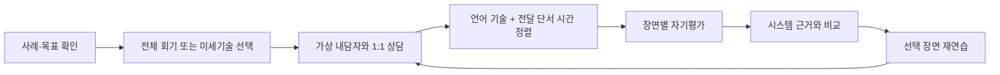

# Affect Counsel Unity

[한국어 상세 문서](README.ko.md) · [English documentation](README.en.md)

> **상담자의 감정을 판정하는 시스템이 아닙니다.** 상담 미세기술과 얼굴·시선·움직임 같은 비언어적 전달이 함께 어떻게 받아들여질 수 있는지 연습하는 한국어 1:1 상담훈련 시뮬레이터입니다.

> **This is not an emotion classifier.** It is a Korean one-to-one counseling simulation for practicing how counseling micro-skills and embodied delivery may work together.


## Why this project

같은 타당화 문장도 표정, 시선, 침묵, 발화 타이밍에 따라 다르게 전달될 수 있습니다. Affect Counsel은 상담자의 내적 감정을 추정하는 대신 다음 관계를 훈련 대상으로 삼습니다.

```text
상담자 언어 기술 + 보정된 비언어 전달 단서
                    ↓ 시간 정렬
       정합 / 가능한 불일치 / 근거 부족
                    ↓
       내담자 안전감 · 경계 · 공개의지
                    ↓
         다음 반응의 개방 또는 위축
```

핵심 연구 방향은 **professional affective performance**, **relational delivery**, 그리고 상담 미세기술과 몸을 통한 전달의 **cross-modal congruence**입니다. 현재 수치는 임상 기준이나 숙련도 점수가 아니라 전문가 검토와 사용자 연구를 위한 프로토타입 규칙입니다.

## Practice loop



시스템 근거는 학습자가 먼저 자기평가한 뒤 공개됩니다. 선택한 장면은 당시 내담자 상태와 발화를 복원하여 한 번 더 연습할 수 있습니다.

| 경로 선택 | 상담 진행 | 자기평가 후 근거 비교 |
|---|---|---|
|  |  |  |

## Capability status

| 상태 | 범위 |
|---|---|
| **구현 완료** | Rocketbox 내담자, 가까운 관찰 카메라, 15분 전체 회기, 3분 집중연습, 연습·평가 모드, 일시정지·디브리핑, 장면 자기평가·재연습, 관계 궤적, 로컬 JSONL 기록, 한·영 UI |
| **실험적** | MediaPipe 기반 13개 AU proxy, 10초 개인 기준선 보정, 언어–비언어 전달 정합 규칙, 한국 상담문화 파일럿 프로필, GPT Realtime 텍스트 연결과 로컬 폴백 |
| **계획 중** | GPT Realtime 음성 입출력, 발화속도·침묵·시선·고개 끄덕임의 시간 정렬, 전문가 사례 편집기, 동의·삭제 흐름, 교육자 대시보드, 다기관 사용자 연구 |
| **검증 필요** | AU proxy의 사람 FACS 코딩 일치도, 피드백 규칙의 전문가 평정 신뢰도, 문화별 단서 해석, 학습전이와 상담역량 변화 |

## Interface

한국 상담실 맥락을 참고한 따뜻한 아이보리·세이지·월넛 환경에서 내담자의 얼굴, 상체, 손을 장식보다 우선해 배치했습니다. 관찰 줌은 시선축을 유지한 채 얼굴 미세표정과 자세·손 제스처 사이를 전환합니다.

| 한국어 UI | English UI |
|---|---|
|  |  |

## Run from source

- Unity: `6000.4.9f1`
- 시작 씬: `Assets/Scenes/KoreanCounselingRoom.unity`
- 씬 재생성: `Tools → Affect Counsel → Build Korean Counseling Room`
- Windows 빌드 출력: `Builds/AffectCounselDemo/AffectCounsel.exe`

웹캠 없이도 로컬 사례 기반 상담 흐름을 실행할 수 있습니다. AU 입력에는 별도의 Python/MediaPipe 브리지가 필요하며, GPT Realtime에는 개발자 소유 임시 토큰 브로커가 필요합니다. 상세 설치와 명령은 [한국어 문서](README.ko.md#실행) 또는 [English build guide](README.en.md#build-and-validation)를 참고하세요.

> 패키징된 공개 데모 릴리스는 아직 제공하지 않습니다. 현재 저장소는 연구·사용성 검토용 소스 프로토타입입니다.

## Privacy and interpretation boundaries

- 웹캠 원본 영상은 저장하지 않으며 파생 신호만 로컬 처리·기록합니다.
- AU 값은 MediaPipe blendshape 기반 proxy이며 인증된 FACS 코딩이나 감정 라벨이 아닙니다.
- 상담자 입력과 파생 신호가 로컬 JSONL에 포함되므로 실제 교육 배포 전 동의, 보존기간, 삭제, 가명화 정책이 필요합니다.
- 피드백은 자기성찰을 위한 근거 후보이며 진단, 임상평가, 상담자 선발 또는 자동 역량평가에 사용하면 안 됩니다.
- LLM 내담자는 안전 통제, 지연 대응, 결정론적 폴백, 전문가 감독 없이 실제 상담을 대신할 수 없습니다.

## Evidence context

가상 내담자 연구는 반복 가능한 저압 환경에서 의사소통을 연습하고 자기 행동을 성찰하는 가능성을 보고해 왔습니다. 다만 자기보고, 작은 표본, 의료·사회복지 인접 맥락에 의존한 연구가 많아 본 프로젝트의 효과를 직접 입증하지는 않습니다.

- [Understanding empathy training with virtual patients](https://doi.org/10.1016/j.chb.2015.05.033)
- [Virtual simulations to train social workers for competency-based learning](https://doi.org/10.1080/10437797.2022.2039819)
- [Virtual clients, real gains: GenAI-simulated counseling role-play](https://doi.org/10.1080/15401383.2026.2666304)

프로젝트의 전체 구성개념, 문화적 해석 원칙, 검증 계획은 [GAME_CONCEPT.md](GAME_CONCEPT.md)에 정리되어 있습니다.

## License and asset boundaries

- Microsoft Rocketbox 자산은 [`Assets/ThirdParty/MicrosoftRocketbox/LICENSE.md`](Assets/ThirdParty/MicrosoftRocketbox/LICENSE.md)를 따릅니다.
- UI 스프라이트는 CC0 라이선스의 [Kenney UI Pack 2.0](https://kenney.nl/assets/ui-pack)을 사용합니다.
- Noto Sans KR은 배포 전에 포함된 폰트 파일의 라이선스 조건을 별도로 확인해야 합니다.
- 저장소 전체를 포괄하는 루트 오픈소스 라이선스는 아직 선언되지 않았습니다. 라이선스가 명시되기 전에는 프로젝트 코드와 생성 자산의 재배포 권한을 가정하지 마세요.

## Documentation

- [한국어 상세 문서](README.ko.md): 회기 흐름, LXD 루프, AU 보정, GPT Realtime 구조, 개인정보 경계
- [English documentation](README.en.md): capabilities, architecture, build, privacy, validation boundaries
- [GAME_CONCEPT.md](GAME_CONCEPT.md): research framing, cultural profile, validation plan

---

**Research and training prototype. Not a diagnostic, emotion-classification, clinical-decision, or automated counselor-assessment tool.**
