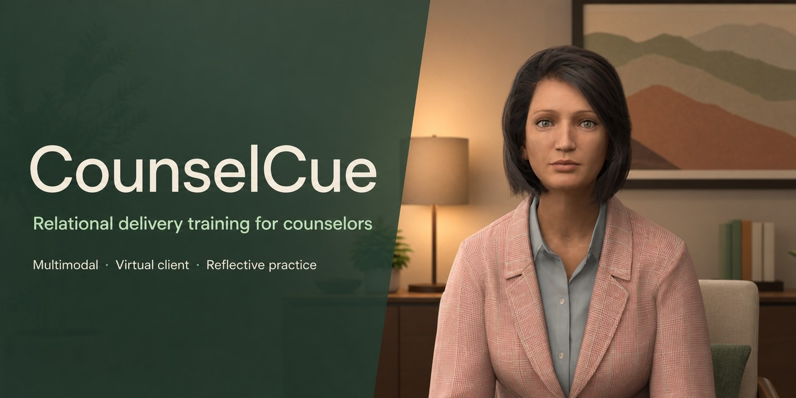
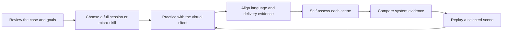

# CounselCue

[Korean documentation](README.ko.md) · [English documentation](README.en.md)

> **This is not an emotion classifier.** CounselCue is a Korean one-to-one counselor-training simulation for practicing how counseling micro-skills and embodied cues such as facial movement, gaze, and posture may work together in relational delivery.



## Why this project

The same validating statement can be received differently depending on facial expression, gaze, silence, and response timing. Instead of inferring the counselor's internal emotional state, CounselCue treats the following relationship as the object of practice:

```text
Counseling micro-skill + calibrated embodied delivery cues
                           ↓ temporal alignment
          aligned / possible mismatch / insufficient evidence
                           ↓
             client safety · guardedness · disclosure
                           ↓
                next response opens or withdraws
```

The research direction centers on **professional affective performance**, **relational delivery**, and **cross-modal congruence** between counseling micro-skills and embodied behavior. Current values are prototype rules for expert review and user research, not clinical thresholds or competency scores.

## Practice loop



System evidence remains hidden until the learner records a self-assessment. A selected scene can then restore the earlier client state and utterance for another attempt.

| Choose a practice path | Conduct the session | Compare evidence after self-assessment |
|---|---|---|
|  |  |  |

## Capability status

| Status | Scope |
|---|---|
| **Implemented** | Rocketbox virtual client, close observation camera, 15-minute full session, three-minute focused practice, coached and assessment modes, pause and debrief flows, scene self-assessment and replay, relational trajectory, local JSONL logging, and Korean/English UI |
| **Experimental** | Thirteen MediaPipe-derived AU proxies, ten-second personal baseline calibration, language-delivery alignment rules, a pilot Korean counseling-culture profile, GPT Realtime text connection, and deterministic local fallback |
| **Planned** | GPT Realtime speech input/output, temporal alignment of speaking rate, silence, gaze, and head nods, expert case-authoring tools, consent and deletion flows, an educator dashboard, and multi-site user research |
| **Requires validation** | Agreement between AU proxies and human FACS coding, expert inter-rater reliability for feedback rules, culture-specific cue interpretation, learning transfer, and change in counseling competence |

## Interface

The scene draws on a contemporary Korean private-practice context with warm ivory, sage, and walnut tones. Client observability takes priority over decoration: the face, upper body, and hands remain visible, while observation zoom moves between facial detail and posture without changing the counselor-client sightline.

| Korean interface | English interface |
|---|---|
|  |  |

## Run from source

- Unity: `6000.4.9f1`
- Start scene: `Assets/Scenes/KoreanCounselingRoom.unity`
- Rebuild the generated scene: `Tools → CounselCue → Build Korean Counseling Room`
- Windows build output: `Builds/CounselCue/CounselCue.exe`

The local case-based counseling flow works without a webcam. AU input requires the separate Python/MediaPipe bridge, and GPT Realtime requires a developer-owned ephemeral-token broker. See the [English build guide](README.en.md#build-and-validation) or [Korean run guide](README.ko.md) for detailed setup and commands.

> No packaged public demo release is available yet. The repository currently provides a source prototype for research and usability review.

## Privacy and interpretation boundaries

- Raw webcam video is not saved; only derived signals are processed and logged locally.
- AU values are proxies derived from MediaPipe blendshapes, not certified FACS coding or emotion labels.
- Counselor input and derived signals are written to local JSONL, so educational deployment requires explicit consent, retention limits, deletion, and pseudonymization policies.
- Feedback is candidate evidence for reflection. It must not be used for diagnosis, clinical evaluation, counselor selection, or automated competency assessment.
- The LLM client cannot replace real counseling and requires safety controls, latency handling, deterministic fallback, and expert supervision.

## Evidence context

Virtual-client research suggests potential value for repeatable, lower-pressure communication practice and reflection. However, much of the evidence relies on self-report, small samples, or adjacent medical and social-work contexts and therefore does not directly establish this project's effectiveness.

- [Understanding empathy training with virtual patients](https://doi.org/10.1016/j.chb.2015.05.033)
- [Virtual simulations to train social workers for competency-based learning](https://doi.org/10.1080/10437797.2022.2039819)
- [Virtual clients, real gains: GenAI-simulated counseling role-play](https://doi.org/10.1080/15401383.2026.2666304)

The complete construct model, cultural interpretation principles, and validation plan are documented in [GAME_CONCEPT.md](GAME_CONCEPT.md).

## License and asset boundaries

- Microsoft Rocketbox assets follow [`Assets/ThirdParty/MicrosoftRocketbox/LICENSE.md`](Assets/ThirdParty/MicrosoftRocketbox/LICENSE.md).
- UI sprites come from the CC0-licensed [Kenney UI Pack 2.0](https://kenney.nl/assets/ui-pack).
- Noto Sans KR is distributed under the SIL Open Font License 1.1; the license is included at [`Assets/Fonts/OFL.txt`](Assets/Fonts/OFL.txt).
- No root open-source license currently covers the entire repository. Do not assume redistribution rights for project code or generated assets until a project license is declared.

## Documentation

- [Korean documentation](README.ko.md): session flow, LXD loop, AU calibration, GPT Realtime architecture, and privacy boundaries
- [English documentation](README.en.md): capabilities, architecture, build workflow, privacy, and validation boundaries
- [GAME_CONCEPT.md](GAME_CONCEPT.md): research framing, cultural profile, and validation plan

---

**Research and training prototype. Not a diagnostic, emotion-classification, clinical-decision, or automated counselor-assessment tool.**
