# CounselCue

[Korean documentation](README.ko.md) · [English documentation](README.en.md)

[**Launch the live WebGL demo →**](https://educatian.github.io/counselcue/)

> **This is not an emotion classifier.** CounselCue is a Korean one-to-one counselor-training simulation for practicing how counseling micro-skills and embodied cues such as facial movement, gaze, and posture may work together in relational delivery.

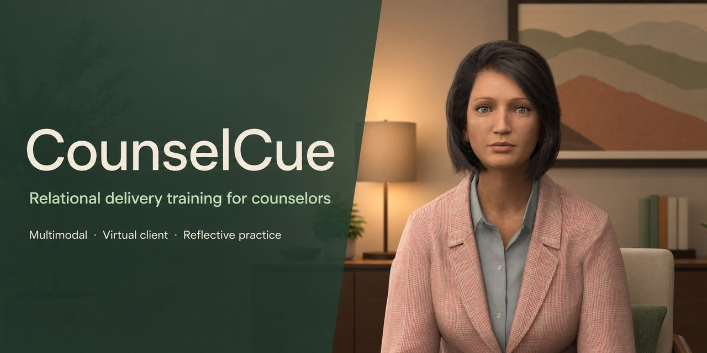

## Why this project

The same validating statement can be received differently depending on facial expression, gaze, silence, and response timing. Instead of inferring the counselor's internal emotional state, CounselCue treats the following relationship as the object of practice:

```text
Counseling micro-skill + calibrated embodied delivery cues
                           ↓ temporal alignment
          aligned / possible mismatch / insufficient evidence
                           ↓
             client safety · guardedness · disclosure
                           ↓
                next response opens or withdraws
```

The research direction centers on **professional affective performance**, **relational delivery**, and **cross-modal congruence** between counseling micro-skills and embodied behavior. Current values are prototype rules for expert review and user research, not clinical thresholds or competency scores.

## Practice loop

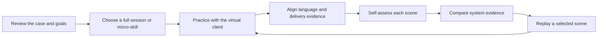
```mermaid
flowchart LR
    A["Review the case and goals"] --> B["Choose a full session or micro-skill"]
    B --> C["Practice with the virtual client"]
    C --> D["Align language and delivery evidence"]
    D --> E["Self-assess each scene"]
    E --> F["Compare system evidence"]
    F --> G["Replay a selected scene"]
    G --> C
```

System evidence remains hidden until the learner records a self-assessment. A selected scene can then restore the earlier client state and utterance for another attempt.

| Choose a practice path | Conduct the session | Compare evidence after self-assessment |
|---|---|---|
| 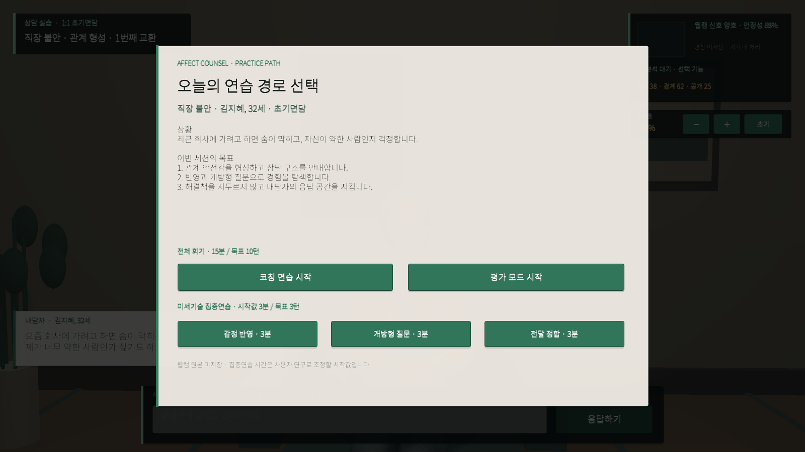 | 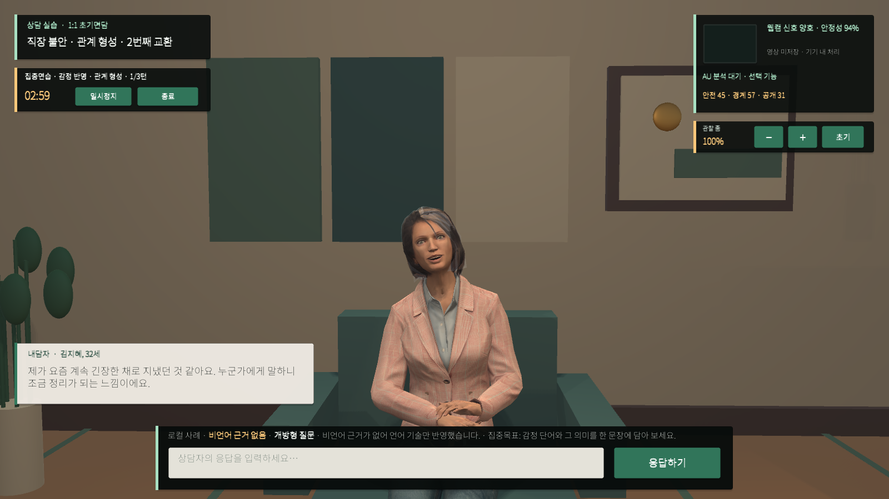 | 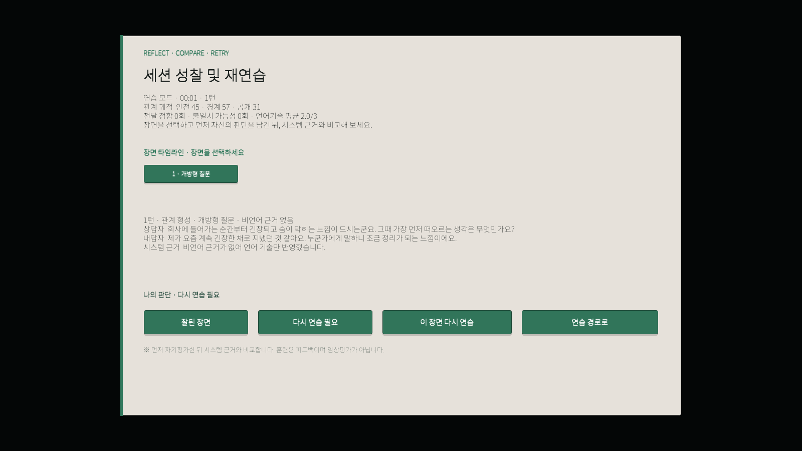 |

## Capability status

| Status | Scope |
|---|---|
| **Implemented** | Five selectable counseling cases with distinct Rocketbox avatars, FACS/viseme facial layers, five-state gaze behavior, Korean viseme planning, micro-blinks/breath/head motion, face-observation zoom and diagnostics, full and focused sessions, replay, relational trajectory, local JSONL logging, Korean/English UI, browser-native Korean input, microphone dictation, spotlight onboarding, ElevenLabs v3 client speech through a server proxy, opt-in local research logging with one-click deletion, a learner export file, and an instructor dashboard (`/dashboard/`) that reads exports in the browser |
| **Experimental** | A **real-time voice mode with Gemini 3.8 Live** (full-duplex speech, barge-in, streamed transcripts coded like typed turns; opt-in on the briefing, web only); an LLM skill coder (`POST /code`, codebook ko-codebook-1) with the Korean lexicon as fallback and both codes logged per turn; a versioned relational model (`avp-prior-1`, exploration weighted ~3× a single empathy component on disclosure) that can be refit from expert ratings; case-specific Korean client personas through OpenRouter, bounded relational-state prompting, four-state emotional voice direction, thirteen MediaPipe-derived counselor AU proxies, personal baseline calibration, and deterministic local fallback |
| **Planned** | Audio-aligned phoneme timing, expert case-authoring tools, server-side retention and pseudonymization policies, and multi-site user research |
| **Requires validation** | Expert-coded Korean reference labels for skill coding (the shipped set is a draft), LLM-coder agreement with those experts, relational weights fitted to Korean ratings, agreement between AU proxies and human FACS coding, culture-specific cue interpretation, learning transfer, and change in counseling competence |

## Interface

The scene draws on a contemporary Korean private-practice context with warm ivory, sage, and walnut tones. Client observability takes priority over decoration: the face, upper body, and hands remain visible, while observation zoom moves between facial detail and posture without changing the counselor-client sightline.

The live room now uses the project's Blender-authored asset pack for the hanji floor lamp, counseling books, acoustic wall panel, woven rug, basket plants, round oak table, linen tissue box, and celadon tea cup.

### Face readability and case selection

The pilot catalog now includes workplace anxiety, adolescent academic pressure, career transition and burnout, older-adult bereavement, and international-student belonging. Selecting a case changes the client profile, facial avatar, nonverbal interpretation parameters, disclosure trajectory, and server persona key together.

| Five-case catalog | Face observation and gaze diagnostics |
|---|---|
| 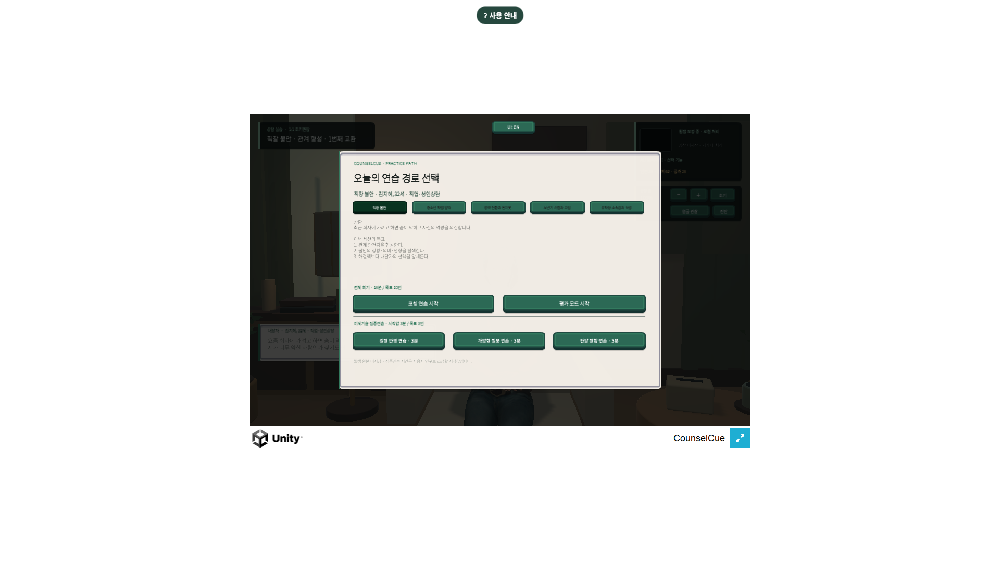 | 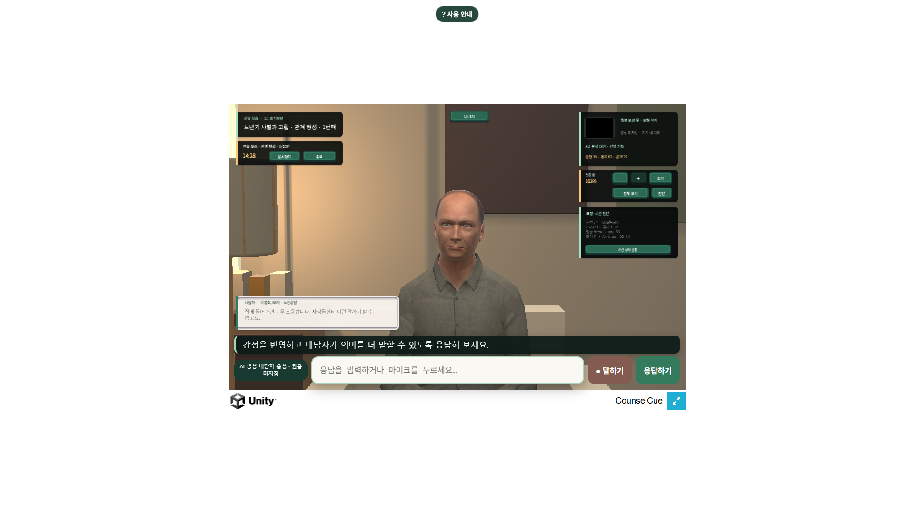 |

The Rocketbox face audit detects 175 blendshapes on the reference avatar, including 15 visemes and the AU shapes used by the relational expression layer. The diagnostics panel exposes the current gaze state, LookAt weight, bound facial shapes, and active viseme for development and expert review.

| Blender-authored counseling room upgrade |
|---|
| 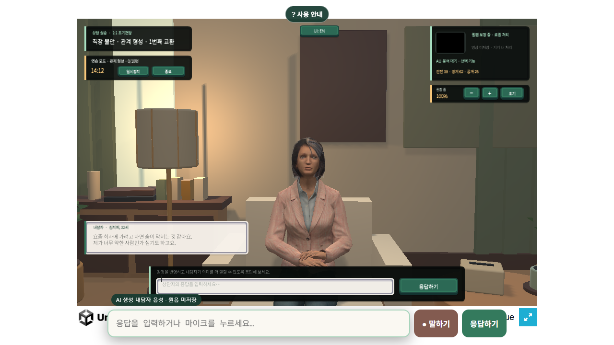 |

| Korean interface | English interface |
|---|---|
| 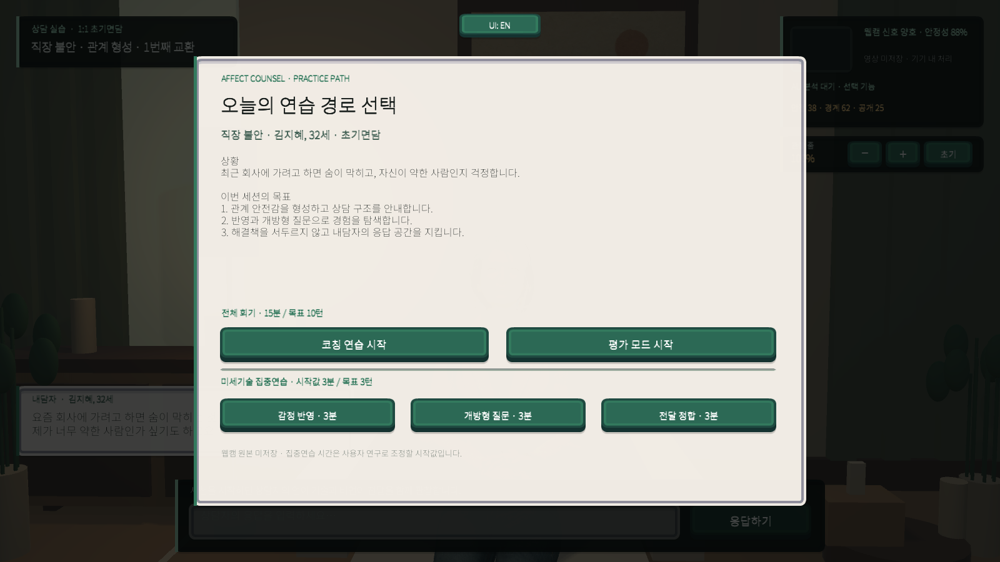 |  |

| Spotlight onboarding | Browser-native voice and Korean input |
|---|---|
| 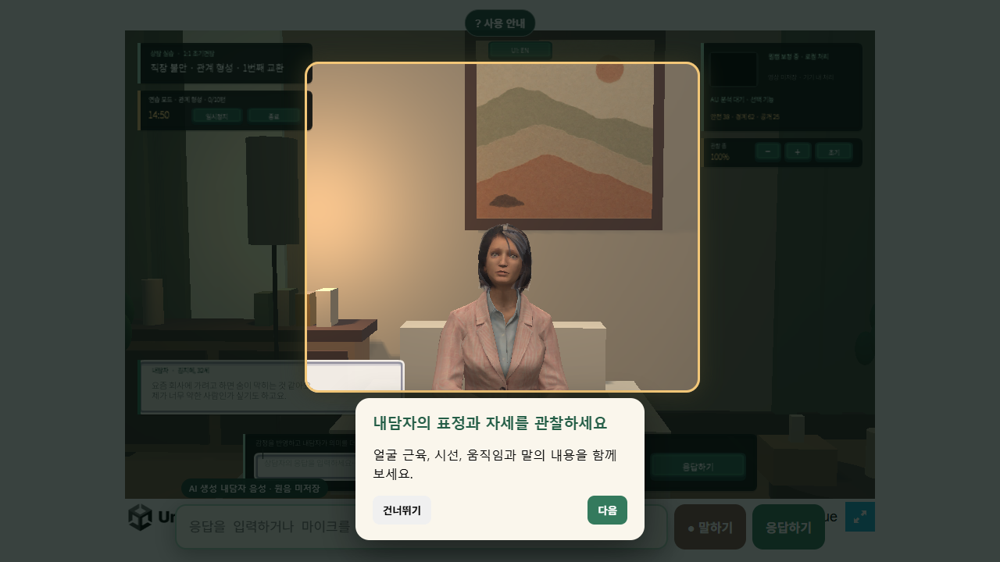 | 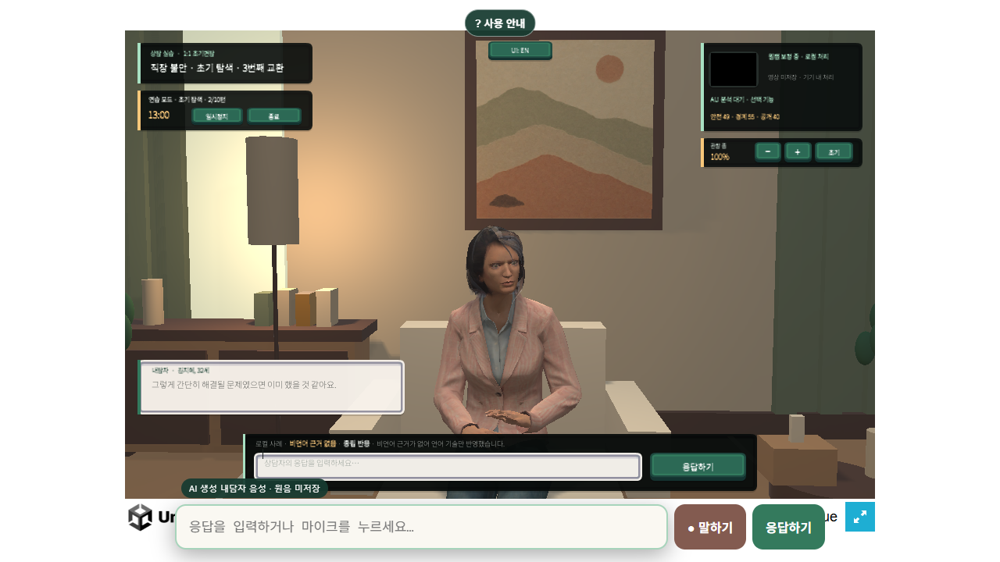 |

## Run from source

- Unity: `6000.4.9f1`
- Start scene: `Assets/Scenes/KoreanCounselingRoom.unity`
- Rebuild the generated scene: `Tools → CounselCue → Build Korean Counseling Room`
- Windows build output: `Builds/CounselCue/CounselCue.exe`
- WebGL build output: `Builds/WebGL/index.html`
- Live browser demo: https://educatian.github.io/counselcue/

The hosted WebGL build uses a server-side persona endpoint when configured and falls back to the deterministic local case engine if the request fails. ElevenLabs and OpenAI keys remain on the edge worker; they are never embedded in Unity or JavaScript. UDP AU input remains desktop-only.

The local case-based counseling flow works without a webcam. AU input requires the separate Python/MediaPipe bridge, and GPT Realtime requires a developer-owned ephemeral-token broker. See the [English build guide](README.en.md#build-and-validation) or [Korean run guide](README.ko.md) for detailed setup and commands.

> No packaged public demo release is available yet. The repository currently provides a source prototype for research and usability review.

## Privacy and interpretation boundaries

- Raw webcam video is not saved; only derived signals are processed and logged locally.
- In the optional live voice mode the microphone audio streams to Google (Gemini Live) in real time; the briefing states this before the learner chooses it. CounselCue stores no audio, and transcripts only when research logging is on. Studies must cover this in their consent wording.
- AU values are proxies derived from MediaPipe blendshapes, not certified FACS coding or emotion labels.
- Local JSONL logging of counselor input and derived signals is off until the learner opts in on the briefing card, and "Delete local records" removes every record file on the device. Institutional deployment still needs retention limits and pseudonymization policies.
- Feedback is candidate evidence for reflection. It must not be used for diagnosis, clinical evaluation, counselor selection, or automated competency assessment.
- The LLM client cannot replace real counseling and requires safety controls, latency handling, deterministic fallback, and expert supervision.

## Evidence context

Virtual-client research suggests potential value for repeatable, lower-pressure communication practice and reflection. However, much of the evidence relies on self-report, small samples, or adjacent medical and social-work contexts and therefore does not directly establish this project's effectiveness.

- [Understanding empathy training with virtual patients](https://doi.org/10.1016/j.chb.2015.05.033)
- [Virtual simulations to train social workers for competency-based learning](https://doi.org/10.1080/10437797.2022.2039819)
- [Virtual clients, real gains: GenAI-simulated counseling role-play](https://doi.org/10.1080/15401383.2026.2666304)

The complete construct model, cultural interpretation principles, and validation plan are documented in [GAME_CONCEPT.md](GAME_CONCEPT.md).

## License and asset boundaries

- Microsoft Rocketbox assets follow [`Assets/ThirdParty/MicrosoftRocketbox/LICENSE.md`](Assets/ThirdParty/MicrosoftRocketbox/LICENSE.md).
- The interface uses procedural sprites in `Assets/Art/UI` (rounded surfaces, soft shadows, scrims and the 談 seal) and the `UiTheme` tokens: hanji paper, ink glass, celadon actions and lamp amber. The CC0 [Kenney UI Pack 2.0](https://kenney.nl/assets/ui-pack) remains in `Assets/ThirdParty` but is no longer referenced.
- Noto Sans KR (static Regular and Bold cuts subset from Noto Sans CJK KR: Hangul syllables, jamo, Latin and punctuation) is distributed under the SIL Open Font License 1.1; the license is included at [`Assets/Fonts/OFL.txt`](Assets/Fonts/OFL.txt).
- No root open-source license currently covers the entire repository. Do not assume redistribution rights for project code or generated assets until a project license is declared.

## Documentation

- [Korean documentation](README.ko.md): session flow, LXD loop, AU calibration, GPT Realtime architecture, and privacy boundaries
- [English documentation](README.en.md): capabilities, architecture, build workflow, privacy, and validation boundaries
- [GAME_CONCEPT.md](GAME_CONCEPT.md): research framing, cultural profile, and validation plan
- [Docs/DATA_SCHEMA.md](Docs/DATA_SCHEMA.md): opt-in local research records (schema v3), the learner export bundle, join keys, and handling guidance
- Skill-coding agreement: [eval/coding/README.md](eval/coding/README.md) — codebook, expert coding protocol, `node eval/coding-agreement.mjs` (κ, per-code F1, confusion; add `WORKER_URL` to score the LLM coder)
- Relational model calibration: [eval/calibration/README.md](eval/calibration/README.md) — refit weights from expert ratings or coded transcripts with `node eval/calibrate-relational.mjs`
- Instructor dashboard: [Dashboard/dashboard.html](Dashboard/dashboard.html) (built into the WebGL template by `Tools/build-dashboard.sh`, served at `/dashboard/`); learners use **기록 내보내기 / Export records** on the briefing card
- Skill lexicon: **Tools → CounselCue → Export Skill Lexicon JSON** writes the pilot term lists to `Assets/Resources/CounselCue/skill-lexicon.json` so counseling experts can revise them; rerun the Response Evaluator Checks after edits
- Persona evaluation: `WORKER_URL=… npm run eval` in `Server/CounselCue.EdgeWorker` checks role consistency, memory, safety and latency on a deployed worker
- CI (`.github/workflows/ci.yml`) runs the worker tests, the Mono-compiled skill-detector, codebook, relational-model and export checks, the coding-agreement regression floor, the calibration pipeline, and case/persona/web-bridge consistency checks without a Unity license
- [Docs/HIGGSFIELD_ASSET_PACK.md](Docs/HIGGSFIELD_ASSET_PACK.md): Higgsfield prompts and drop-in file slots for case illustrations, room art, loading/onboarding visuals, and an honest promo-video shot list

---

**Research and training prototype. Not a diagnostic, emotion-classification, clinical-decision, or automated counselor-assessment tool.**
